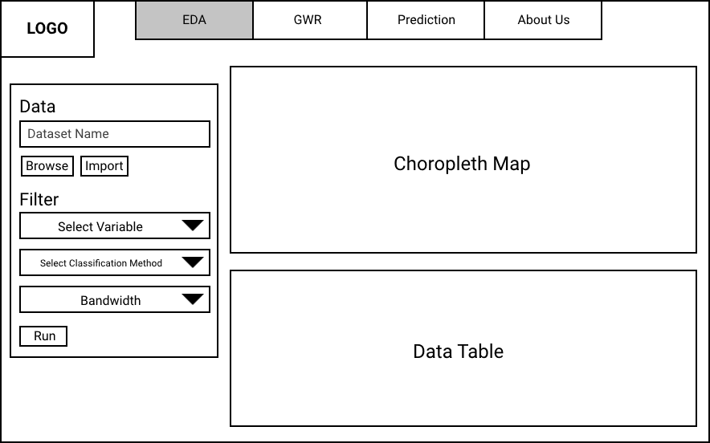
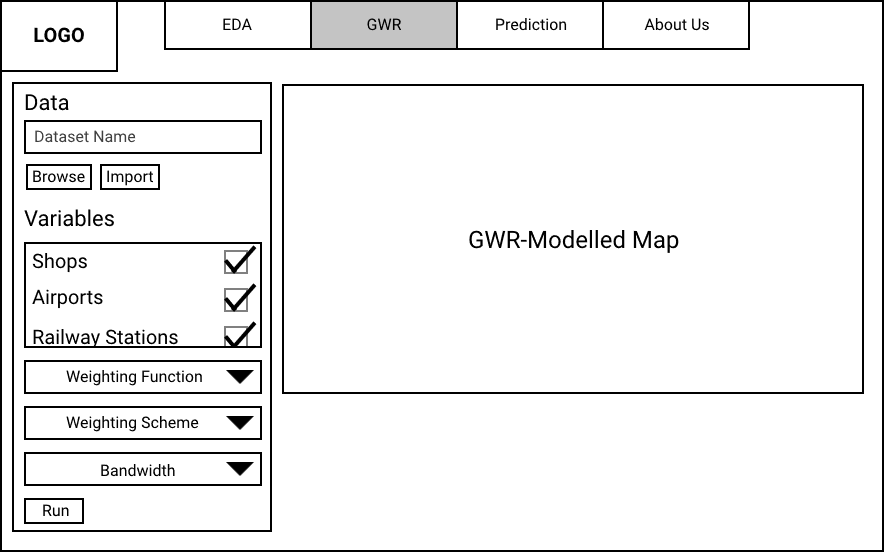
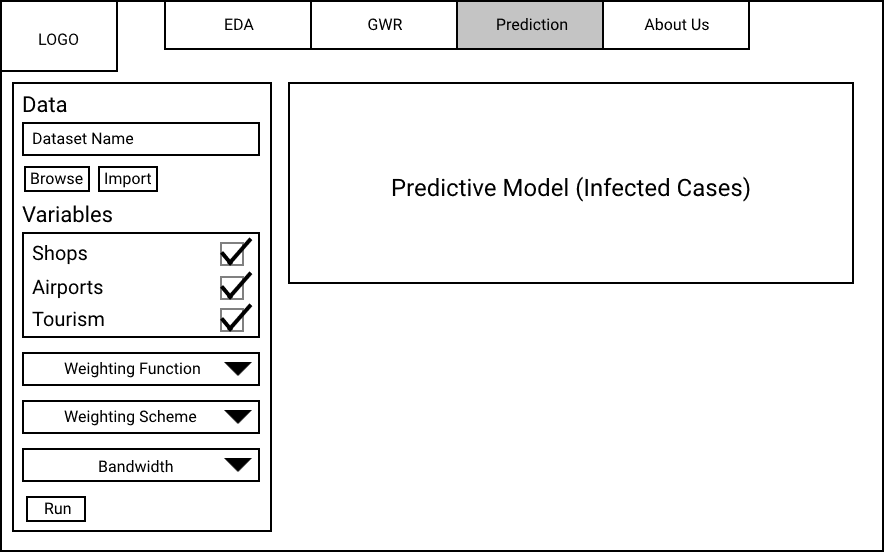

```{r setup, include=FALSE}
knitr::opts_chunk$set(echo = FALSE)
```

## Project Motivation

COVID-19 has become an indisputable part of our daily life ever since the virus spread to the majority of the world. Some countries have been able to keep the situation under control, however, there are some that suffered more devastating effects from it. India and Indonesia are 2 countries in Asia that have the highest COVID related mortality and positive rates (Worldometers, n.d.) for COVID-19 cases, especially so in the main capital of the respective countries, likely due to certain underlying common factors within the countries.

Researchers claims that Indonesia's capital, Jakarta, could have as many as 4.7 million people who are possibly infected by the virus in March 2021 (Sood, 2021). This is alarming as this number constitutes to "nearly half" of Jakarta's population.

## Project Objective

Our research would focus on identifying the factors that may have played a part in Jakarta's high infection rate, how much each factor contributes to the rates itself and how much of the infection rate can be explained by these factors, before applying the same model onto other countries to verify our observations.

## Datasets

### Indonesia Monthly Covid Data

Description: The data contain COVID-19 measures at sub-district level.

File Format: Excel

Variables: ID_KEL, Nama_provinsi, nama_kota, nama_kecamatan, nama_kelurahan, POSITIF, Meninggal

Source: https://riwayat-file-covid-19-dki-jakarta-jakartagis.hub.arcgis.com/ 
 
### Indonesia Population Density / Counts 2020

Description: The datasets contain population density / total number of people in Indonesia per grid-cell, at resolution of 30 arc (approximately 1km).

File Format: TIF

Source: https://www.worldpop.org/

### Indonesia Birth 2015

Description: The data contain numbers of live births per grid square in Indonesia, at resolution of 30 arc (approximately 1km).

File Format: TIF

Source: https://www.worldpop.org/
 
### Batas Desa Provinsi DKI Jakarta 

Description: This is the geospatial data of DKI Jarkarta.

File Format: Shapefile

Variables: OBJECT_ID, KODE_DESA, DESA, KODE, PROVINSI, KAB_KOTA, KECAMATAN. DESA_KELUR, JUMLAH_PEN

Source: https://www.indonesia-geospasial.com/ 

### Jakarta Railway

Description: The data contain railways and stations in Jakarta.

File Format: Shapefile

Variables: name, railway

Source: https://data.humdata.org/ 

### Jakarta Education

Description: The data contain kindergartens, schools, colleges, and universities in Jakarta.

File Format: Shapefile

Variables: name, amenity, addrcity

Source: https://data.humdata.org/ 

### Jakarta Airport

Description: The data contain gates, helipads, and terminals in Jakarta.

File Format: Shapefile

Variables: name, aeroway

Source: https://data.humdata.org/ 
 
### Jakarta Points of Interests

Description: The data contain amenities, shops, and tourist attractions in Jakarta.

File Format: Shapefile

Variables: name, amenity, shop, tourism

Source: https://data.humdata.org/ 
 
### Jakarta Health Facilities

Description: The data contains healthcare facilities in Jakarta.

File Format: Shapefile

Variables: Name, Address, Type, Class, District, Province, Lat, Long, Hospital

Source: https://data.humdata.org/ 

## Literature Review

The focus of our analysis will be on infection rates and we will draw similar methodology from the papers researching on death rates.

### 1. Geographically weighted regression (GWR) analysis on the death incidence by COVID-19 in São Paulo, Brazil

```{r echo=FALSE, fig.align='center',out.width='60%'}
knitr::include_graphics("images/brazil.jpg")
```

#### **Objective**

To gain an understanding of how socio-spatial behaviour causes COVID-19 transmission in the most impacted area in Brazil.

#### **Methodology**

- Spearman correlation test
- Adjusted R2
- Ordinary least squares (OLS)
- Spatial error model (SEM) 
- Spatial lag model (SLM) 
- Geographically weighted regression (GWR)  
- Multiscale geographically weighted regression (MGWR)

#### **Learning Point**

- The use of spearman correlation test to further see if the factors identified were relevant for the regression model
- The results has shown that GWR model well represented the spatial distribution of COVID-19 in São Paulo, highlighting the spatial aspects of data among other spatial regression models

#### **Areas for Improvement**

- A preliminary analysis could be conducted for the co-occurrence of global and local models to understand the spread of the COVID-19 better and also other infectious diseases in large cities first.
- The use of MGWR could be considered for a more detailed analysis.

### 2. Geographically varying relationships of COVID-19 mortality with different factors in India

```{r echo=FALSE, fig.align='center',out.width='60%'}
knitr::include_graphics("images/india.jpg")
```

#### **Objective**

To understand the relationship geographically for how different driving factors affect COVID-19 deaths.

#### **Methodology**

- Variance Inflation Factor (VIF): to get rid of unnecessary redundancy in explanatory variables.
- Ordinary least squares (OLS)
- Geographically weighted regression (GWR)

#### **Learning Point**

- The use of local models helps to visualize geographically varying heterogeneous relationships between the dependent and the independent variables as it gives a more comprehensive understanding of relationships based on geographical contexts and study area’s known features.

#### **Areas for Improvement**

- Consider the use of time evolution variables to further look at time series data for the dependent and independent variables to do more effective temporal modelling.

### 3. The effect of sociodemographic factors on COVID-19 incidence of 342 cities in China: a geographically weighted regression model analysis

```{r echo=FALSE, fig.align='center',out.width='60%'}
knitr::include_graphics("images/china.jpg")
```

#### **Objective**

To gain an understanding of how socio-demographic factors causes COVID-19 transmission in 342 cities in China in a geographic perspective.

#### **Methodology**

- Local geographically weighted Poisson regression (GWPR) model 
- Traditional generalized linear models (GLM) Poisson regression model

#### **Learning Point**

- There are different ways to conduct GWR, which in this case was the use of the poisson regression model.

#### **Areas for Improvement**

- Could look into confounding factors such as age, gender nationality for the multivariate analysis.

## Methodology

**1. Data Preparation **

* Data Sourcing

* Data Importing

* Data Wrangling

**2. Exploratory Data Analysis (EDA)**

* Statistical Graphs

    + Histogram

    + Box Plot

* Choropleth Map

* Kernel Density Estimation

**3. Geographically Weighted Regression Models (GWR)**

* Spearman Correlation Coefficient

    Spearman Correlation Coefficient is used to determine the most relevant explanatory variables for the regression models

* Cross-Validation score

    Cross Validation Score is used to identify a window size to get different subsets of the data to be parsed into the model. (Mennis, 2006) (Farber & Antonio, 2007)

* Akaike Information Criteria (AIC) score

    AIC evaluates the model generated from the data and sees how well the model can fit other data. It also determines the best evaluated model        that best fits data. (Mennis & Jeremy, 2006)

## Storyboard

### 1. EDA and DataTable

```{r echo=FALSE, fig.align='center',out.width='60%'}

```

### 2. GWR

```{r echo=FALSE, fig.align='center',out.width='60%'}

```

### 3. Prediction

```{r echo=FALSE, fig.align='center',out.width='60%'}

```

## References

+ A.I.Middya, S.Roy (2021, April 12). Geographically varying relationships of COVID-19 mortality with different factors in India. Retrieved October 9, 2021, from https://www.nature.com/articles/s41598-021-86987-5 

+ Farber, Steven & Páez, Antonio. (2007). A systematic investigation of cross-validation in GWR model estimation: Empirical analysis and Monte Carlo simulations. Journal of Geographical Systems. 9. 371-396. 10.1007/s10109-007-0051-3.

+ H.Zhang, Y.Liu, F.Chen, B.Mi, L.Zeng, L.Pei (2021, May 07). The effect of sociodemographic factors on COVID-19 incidence of 342 cities in China: a geographically weighted regression model analysis. Retrieved October 9, 2021, from https://bmcinfectdis.biomedcentral.com/articles/10.1186/s12879-021-06128-1

+ Mennis, Jeremy (2006) “Mapping the Results of Geographically Weighted Regression”, The Cartographic Journal, Vol.43 (2), p.171-179.

+ R.C.Urban, L.Y.K.Nakada (2020). GIS-based spatial modelling of COVID-19 death incidence in São Paulo, Brazil. Retrieved October 9, 2021, from https://journals.sagepub.com/doi/pdf/10.1177/0956247820963962 

+ Sood, A. S. (2021, July 14). Indonesia Covid-19: Almost half of Jakarta’s population may have caught the virus, survey finds. Retrieved October 9, 2021, from https://edition.cnn.com/2021/07/13/asia/indonesia-antibody-study-covid-intl-hnk-scli/index.html

+ Worldometers. (n.d.). COVID Live Update: 237,632,869 Cases and 4,851,284 Deaths from the Coronavirus - Worldometer. Retrieved October 8, 2021, from https://www.worldometers.info/coronavirus/#countries
